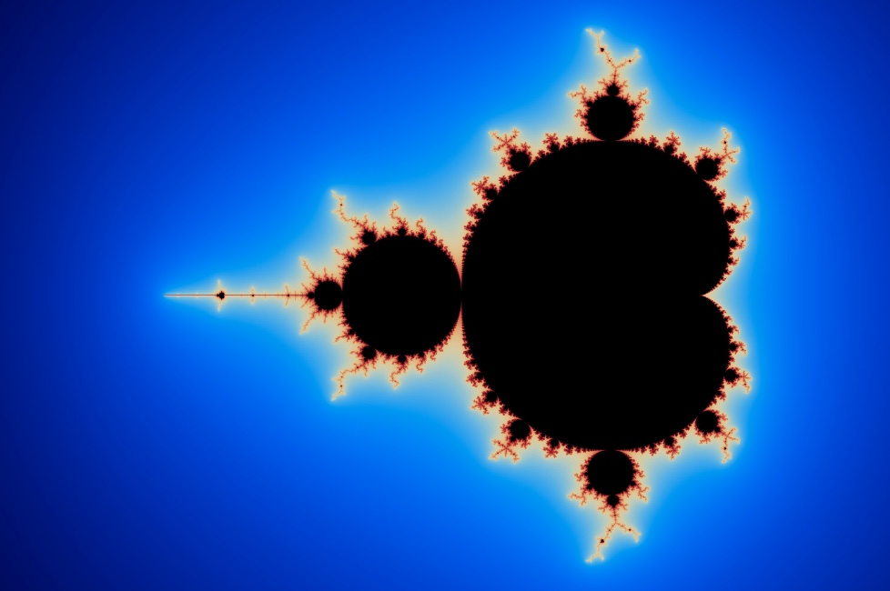

# Fract'ol

## 📊 Overview

Fract'ol is a graphical exploration of mathematical fractals, rendered using the MiniLibX library. This project demonstrates my ability to implement complex mathematical concepts in code, optimize rendering performance, and create an interactive graphical experience.



## 🔍 Features

- **Multiple Fractal Types**:
  - Mandelbrot Set
  - Julia Set with variable parameters
  - [Additional fractal type] *(Bonus)*

- **Real-time Interaction**:
  - Infinite zoom capability following mouse position
  - Color palette shifting for visual enhancement
  - Coordinate navigation with arrow keys
  - Parameter adjustment for Julia sets

- **Performance Optimization**:
  - Multi-threading for faster rendering
  - Efficient calculation algorithms
  - Dynamic resolution adjustment

## 🚀 Usage

### Prerequisites

- GCC/Clang compiler
- Make
- X11 development libraries (for MiniLibX)

### Installation

```bash
# Clone the repository
git clone https://github.com/Melis-Pablo/fractol.git
cd fractol

# Compile the program
make
```

### Running the Program

```bash
# Display usage information
./fractol

# Render the Mandelbrot set
./fractol mandelbrot

# Render the Julia set with specific parameters
./fractol julia [real] [imaginary]

# Render additional fractal type
./fractol [fractal_name]
```

### Controls

| Key/Action | Function |
|------------|----------|
| Mouse wheel | Zoom in/out |
| Left click | Center view at clicked point |
| Arrow keys | Move view |
| ESC | Exit program |
| C | Cycle color schemes |
| R | Reset view |
| + / - | Increase/decrease iteration depth |

## 🧮 Mathematical Concepts

### Complex Numbers

Fractals are rendered by iterating functions with complex numbers:
```
z = z² + c
```

Where:
- `z` is a complex number (with real and imaginary parts)
- `c` is a constant complex number

### Iterative Algorithm

The coloring of each pixel is determined by:
1. Assigning each pixel to a complex number on the plane
2. Iterating the fractal formula until:
   - The value exceeds escape radius (unbounded)
   - The maximum iteration count is reached (bounded)
3. Mapping the iteration count to a color

## 💡 Technical Implementation

### Rendering Pipeline

1. **Setup**: Initialize window and image buffer
2. **Calculation**: Compute fractal values for each pixel
3. **Coloring**: Apply color mapping based on calculation results
4. **Display**: Push the image to window
5. **Interaction**: Handle user input for navigation and adjustments

### Optimization Techniques

- **Sequential Memory Access**: Optimized pixel writing for cache efficiency
- **Early Bailout**: Quick detection of unbounded points
- **Boundary Detection**: Skipping calculations in solid regions

## 📝 What I Learned

- **Computer Graphics**: Practical experience with the MiniLibX library
- **Complex Mathematics**: Implementation of fractal mathematics
- **Performance Optimization**: Techniques to improve rendering speed
- **Event Handling**: Managing user input in a graphical environment
- **Color Theory**: Creating visually appealing color mappings

## 🔧 Technical Requirements

- Language: C
- Graphics: MiniLibX
- External functions: open, close, read, write, malloc, free, perror, strerror, exit, math functions
- Build system: Make

## 📄 Documentation

For detailed information about the project requirements, see [fract-ol.md](fract-ol.md).

---

*This project is part of the 42 School Common Core curriculum.*