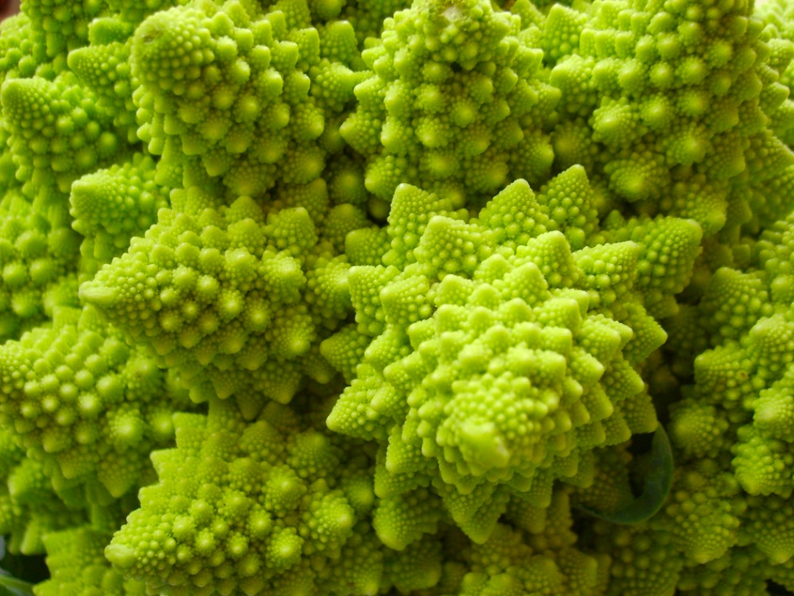

# fract’ol

### Computer Graphics Fractals

>[!note]
>Summary: This project is about creating graphically beautiful fractals.
 Version: 3

## 0. Contents
---

1. Foreword
2. Introduction
3. Objectives
4. Common Instructions
5. Mandatory part
	1. Rendering
	2. Graphic management
6. Bonus part
7. Submission and peer-evaluation

## 1. Foreword
---

Here’s what Wikipedia has to say on hydraulic fracturing:

The "hydraulic fracturing," is the targeted disruption of geological formations with low permeability by means of injection under high pressure of a fluid to micro-cracking and crack the rock. This fracturing can be performed near the surface or at depth (over 1 km or more than 4 km in the case of shale gas) and from vertical wells, sloped or horizontal.

This relatively old technique (1947), developed for conventional oil deposits, is renewed by its association with horizontal drilling (developed from 1980). It is the gradual mastery of the economic viability of this association for non-conventional deposits, who guided the recent development of the operation of these: it made available formerly inaccessible resources, or which have been exploited at exorbitant costs and slowly.

It is performed by fracturing the rock by a mechanical "stress" using a fluid injected under high pressure from a surface drilling, to increase the macro porosity and less the micro porosity. The fluid could be the water, a slurry or a technical fluid whose viscosity was adjusted.

This project is not called fract’oil and accordingly has no relation to hydraulic fracturing.

## 2. Introduction
---

The term fractal was first used by mathematician Benoit Mandelbrot in 1974. He based it on the Latin word fractus which means "broken" or "fractured".

A fractal is an abstract mathematical object, like a curve or a surface, which pattern remains the same at every scale.

Various natural phenomena – like the romanesco cabbage – have some fractal features.

Now, it’s your turn to generate some magnificent fractals!

## 3. Objectives
---

It’s time for you to create a basic computer graphics project!

You are going to use the school graphical library: the MiniLibX! This library was developed internally and includes basic necessary tools to open a window, create images and deal with keyboard and mouse events.

This will be the opportunity for you to get familiar with the MiniLibX, to discover or use the mathematical notion of complex numbers, to take a peek at the concept of optimization in computer graphics and practice event handling.

Don’t forget to watch the videos on e-learning!

## 4. Common Instructions
---

- Your project must be written in C.
- Your project must be written in accordance with the Norm. If you have bonus files/functions, they are included in the norm check and you will receive a 0 if there is a norm error inside.
- Your functions should not quit unexpectedly (segmentation fault, bus error, double free, etc) apart from undefined behaviors. If this happens, your project will be considered non functional and will receive a 0 during the evaluation.
- All heap allocated memory space must be properly freed when necessary. No leaks will be tolerated.
- If the subject requires it, you must submit a Makefile which will compile your source files to the required output with the flags -Wall, -Wextra and -Werror, use cc, and your Makefile must not relink.
- Your Makefile must at least contain the rules $(NAME), all, clean, fclean and re.
- To turn in bonuses to your project, you must include a rule bonus to your Makefile, which will add all the various headers, libraries or functions that are forbidden on the main part of the project. Bonuses must be in a different file _bonus.{c/h} if the subject does not specify anything else. Mandatory and bonus part evaluation is done separately.
- If your project allows you to use your libft, you must copy its sources and its associated Makefile in a libft folder with its associated Makefile. Your project's Makefile must compile the library by using its Makefile, then compile the project.
- We encourage you to create test programs for your project even though this work won't have to be submitted and won't be graded. It will give you a chance to easily test your work and your peers' work. You will find those tests especially useful during your defence. Indeed, during defence, you are free to use your tests and/or the tests of the peer you are evaluating.
- Submit your work to your assigned git repository. Only the work in the git repository will be graded. If Deepthought is assigned to grade your work, it will be done after your peer-evaluations. If an error happens in any section of your work during Deepthought's grading, the evaluation will stop.

## 5. Mandatory part
---

| Program name       | fractol                                                                                                                                                                                                                           |
| ------------------ | --------------------------------------------------------------------------------------------------------------------------------------------------------------------------------------------------------------------------------- |
| Turn in files      | Makefile, \*.h, \*.c                                                                                                                                                                                                              |
| Makefile           | NAME, all, clean, fclean, re                                                                                                                                                                                                      |
| Arguments          | The type of fractal to display and any other option available                                                                                                                                                                     |
| External functions | • open, close, read, write, malloc, free, perror, strerror, exit  • All functions of the math library (-lm compiler option, man 3 math)  • All functions of the MiniLibX  • ft_printf and any equivalent YOU coded |
| Libft authorized   | yes                                                                                                                                                                                                                               |
| Description        | This project is about creating a small fractal exploration program. First, you have to know what a fractal is.                                                                                                              |

Your project must comply with the following rules:

- You must use the MiniLibX. Either the version available on the school machines, or installing it using its sources.

- You have to turn in a Makefile which will compile your source files. It must not relink.

- Global variables are forbidden.

### 5.1 Rendering

- Your program must offer the Julia set and the Mandelbrot set.

- The mouse wheel zooms in and out, almost infinitely (within the limits of the computer). This is the very principle of fractals.

- You must be able to create different Julia sets by passing different parameters to the program.

- A parameter is passed on the command line to define what type of fractal will be displayed in a window.
	- You can handle more parameters to use them as rendering options.
	- If no parameter is provided, or if the parameter is invalid, the program displays a list of available parameters and exits properly.

- You must use at least a few colors to show the depth of each fractal. It’s even better if you hack away on psychedelic effects.

### 5.2 Graphic management

- Your program has to display the image in a window.

- The management of your window must remain smooth (changing to another window, minimizing, and so forth).

- Pressing ESC must close the window and quit the program in a clean way.

- Clicking on the cross on the window’s frame must close the window and quit the program in a clean way.

- The use of the images of the MiniLibX is mandatory.

## 4. Bonus part
---

Usually, you would be encouraged to develop your own original extra features. However, there will be much more interesting graphic projects later. They are waiting for you!!
Don’t lose too much time on this assignment!

You will get some extra points with the following features:

- One more different fractal (more than a hundred different types of fractals are referenced online).
- The zoom follows the actual mouse position.
- In addition to the zoom: moving the view by pressing the arrows keys.
- Make the color range shift.

>[!warning]
>The bonus part will only be assessed if the mandatory part is
PERFECT. Perfect means the mandatory part has been integrally done
and works without malfunctioning. If you have not passed ALL the
mandatory requirements, your bonus part will not be evaluated at all.

## 5. Submission and peer-evaluation
---

Turn in your assignment in your Git repository as usual. Only the work inside your repository will be evaluated during the defense. Don't hesitate to double check the names of your files to ensure they are correct.

As these assignments are not verified by a program, feel free to organize your files as you wish, as long as you turn in the mandatory files and comply with the requirements.

